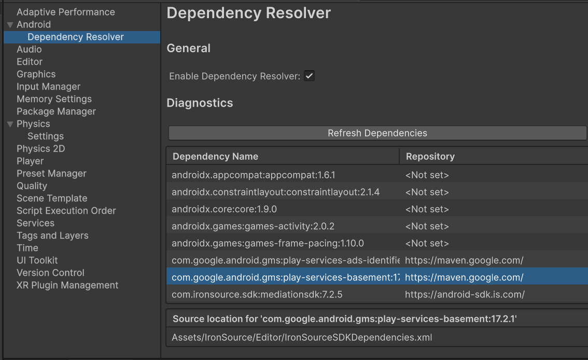

# Unity Android Dependency Resolver




## Requirements

* Unity 2023.3 or higher

## Installation

* Go to Window->Package Manager
* In top left corner click **+** button, choose **Install Package from git URL**
* Enter

```
    https://github.com/todi1856/com.unity.android.dependency-resolver.git?path=/Package
```

* That's it, check Edit->Project Settings->Android->Dependency Resolver

## Overview

Dependency Resolver (**UADR**) provides the same functionality as [Google's External Dependency Manager](https://github.com/googlesamples/unity-jar-resolver) (**EDM4U**), but does that through [Configuration Manager](https://docs.unity3d.com/2023.3/Documentation/Manual/android-modify-gradle-project-files-agp.html).

How gradle dependencies are resolved:

| **EDM4U** | **UADR** |
|-----------|----------|
| Resolves dependencies:<br> * If templates are disabled - downloads dependencies to Assets/Plugins/Android.<br>* If templates are enabled - injects dependencies into template scripts.<br>If there are local repository specified, creates Assets/GeneratedLocalRepo folder. | Injects dependencies into gradle files using [Configuration Manager](https://docs.unity3d.com/2023.3/Documentation/Manual/android-modify-gradle-project-files-agp.html).<br>If there are local repositories, those are created directly in gradle project. |


Starting Unity 2023.3, it's recommended to use **Configuration Manager** for gradle project manipulation, but **Configuration Manager** cannot patch gradle files if they're patched via templates.

Also, downloading dependencies into Assets/Plugins/Android folder creates dependency conflicts if GameActivity is enabled as application entry point.

Due reasons above, **EDM4U** might not work for your case, especially if you're targeting GameActivity.


## Settings

The settings can be located in **Project Settings->Android->Dependency Resolver**.

| **Name** | **Description** |
|----------|-----------------|
|Enable Dependency Resolver | When enabled the gradle files will populated with dependency information.|
|Refresh Dependencies| You can inspect in advance what dependencies will be added to gradle project and can see the location from where they originate.
